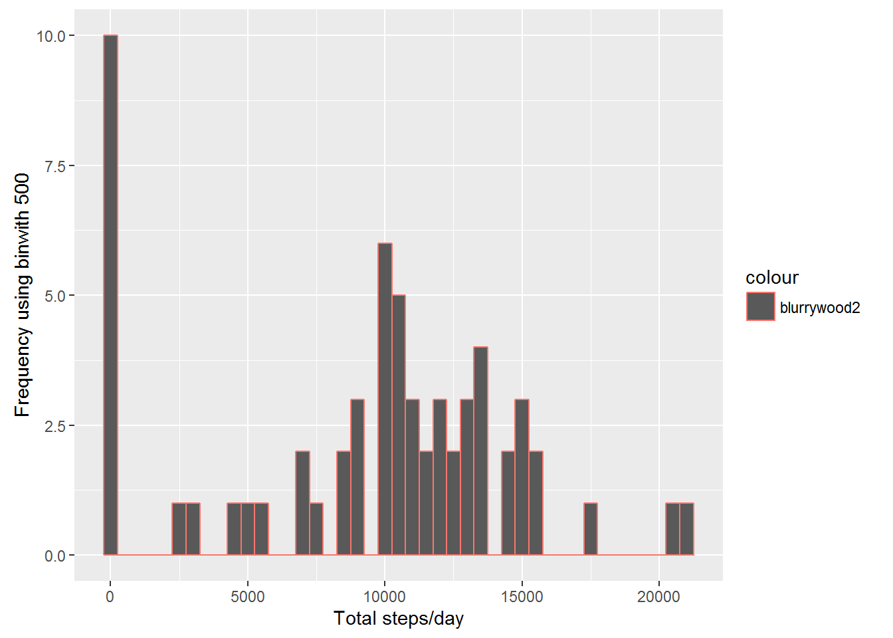
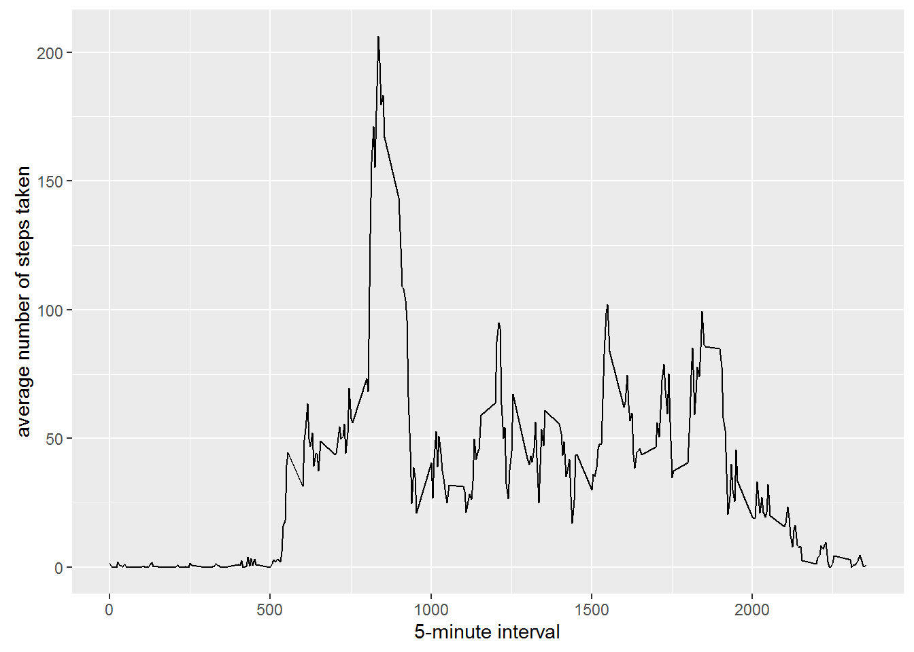
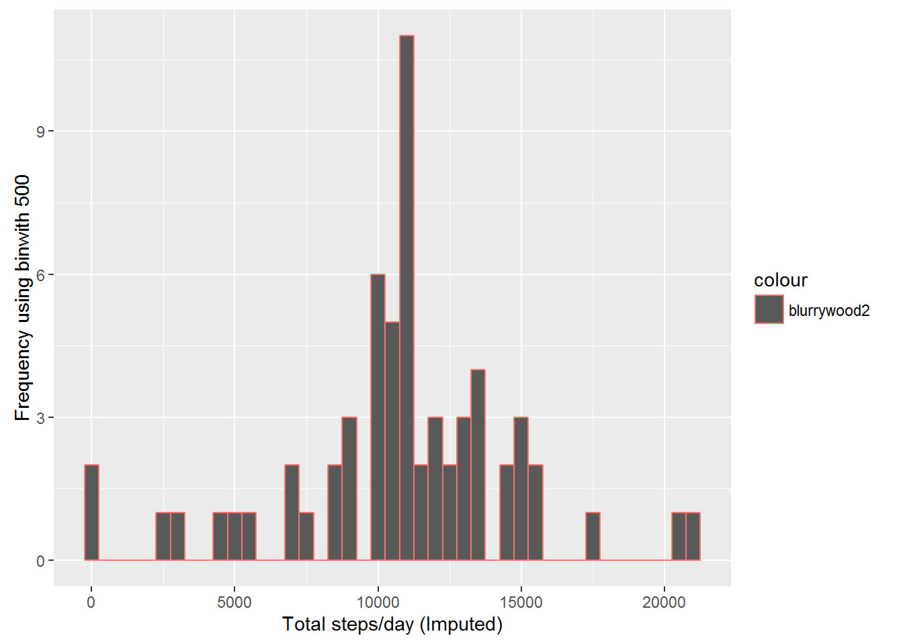
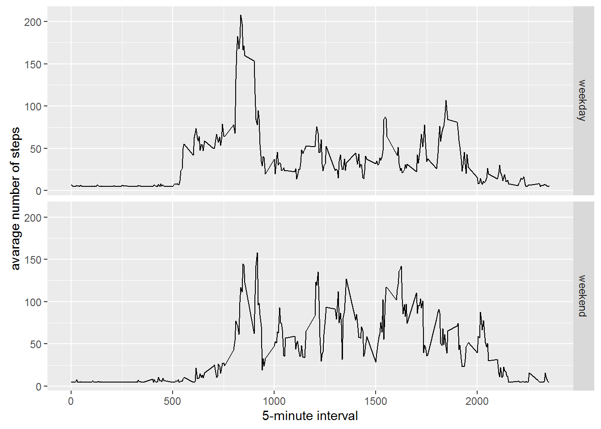

# Reproducible Research: Peer Assessment 1
##Analyzing Data from FitBit

---
Lok Raj Bist
May, 2016
---
###Introduction
This is the first project of the Reproducible Research course in Coursera's Data Science Specialization track. This project is to answer the questions using data collectd from a FitBit.
The purpose of this project was to practice:

* loading and preprocessing data
* imputing missing values
* interpreting data to answer research questions

###Libraries required:
* ggplot2
* scales
* Hmisc

```{r, echo=FALSE, results='hide', warning=FALSE, message=FALSE}
library(ggplot2)
library(scales)
library(Hmisc)
```

## Loading and preprocessing the data
##### 1. Load the data (i.e. read.csv())
```{r, results='markup', warning=TRUE, message=TRUE}
if(!file.exists('activity.csv')){
    unzip('activity.zip')
}
fitBitActivityData <- read.csv('activity.csv')
```
##### 2. Process/transform the data (if necessary) into a format suitable for your analysis
```{r}
#fitBitActivityData$interval <- strptime(gsub("([0-9]{1,2})([0-9]{2})", "\\1:\\2", fitBitActivityData$interval), format='%H:%M')
```

-----

## What is mean total number of steps taken per day?
```{r}
totalStepsByDay <- tapply(fitBitActivityData$steps, fitBitActivityData$date, sum, na.rm=TRUE)
```

##### 1. Make a histogram of the total number of steps taken each day
```{r}
qplot(totalStepsByDay, col='blurrywood2', xlab='Total steps/day', ylab='Frequency using binwith 500', binwidth=500)
```
 

##### 2. Calculate and report the mean and median total number of steps taken/day
```{r}
totalStepsByDayMean <- mean(totalStepsByDay)
totalStepsByDayMedian <- median(totalStepsByDay)
```
* Mean: `r totalStepsByDayMean`
* Median:  `r totalStepsByDayMedian`

-----

## What is the average daily activity pattern?
```{r}
averageActivityStepsPerTimeBlock <- aggregate(x=list(meanSteps=fitBitActivityData$steps), by=list(interval=fitBitActivityData$interval), FUN=mean, na.rm=TRUE)
```

##### 1. Make a time series plot
```{r}
ggplot(data=averageActivityStepsPerTimeBlock,col='blurrywood2', aes(x=interval, y=meanSteps)) +
    geom_line() +
    xlab("5-minute interval") +
    ylab("average number of steps taken") 
```
 


##### 2. Which 5-minute interval, on average across all the days in the dataset, contains the maximum number of steps?
```{r}
mostSteps <- which.max(averageActivityStepsPerTimeBlock$meanSteps)
timeMostSteps <-  gsub("([0-9]{1,2})([0-9]{2})", "\\1:\\2", averageActivityStepsPerTimeBlock[mostSteps,'interval'])
```

* Most Steps at: `r timeMostSteps`

----

## Imputing missing values
##### 1. Calculate and report the total number of missing values in the dataset 
```{r}
numMissingValues <- length(which(is.na(fitBitActivityData$steps)))
```

* Number of missing values: `r numMissingValues`

##### 2. Devise a strategy for filling in all of the missing values in the dataset.
##### 3. Create a new dataset that is equal to the original dataset but with the missing data filled in.
```{r}
fitBitActivityDataImputed <- fitBitActivityData
fitBitActivityDataImputed$steps <- impute(fitBitActivityData$steps, fun=mean)
```


##### 4. Make a histogram of the total number of steps taken each day 
```{r}
totalStepsByDayImputed <- tapply(fitBitActivityDataImputed$steps, fitBitActivityDataImputed$date, sum)
qplot(totalStepsByDayImputed,col='blurrywood2', xlab='Total steps/day (Imputed)', ylab='Frequency using binwith 500', binwidth=500)
```
 

##### ... and Calculate and report the mean and median total number of steps taken per day. 
```{r}
totalStepsByDayMeanImputed <- mean(totalStepsByDayImputed)
totalStepsByDayMedianImputed <- median(totalStepsByDayImputed)
```
* Mean (Imputed): `r totalStepsByDayMeanImputed`
* Median (Imputed):  `r totalStepsByDayMedianImputed`


----

## Are there differences in activity patterns between weekdays and weekends?
##### 1. Create a new factor variable in the dataset with two levels - "weekday" and "weekend" indicating whether a given date is a weekday or weekend day.

```{r}
fitBitActivityDataImputed$dateType <-  ifelse(as.POSIXlt(fitBitActivityDataImputed$date)$wday %in% c(0,6), 'weekend', 'weekday')
```

##### 2. Make a panel plot containing a time series plot

```{r}
averagedfitBitActivityDataImputed <- aggregate(steps ~ interval + dateType, data=fitBitActivityDataImputed, mean)
ggplot(averagedfitBitActivityDataImputed,col='blue', aes(interval, steps)) + 
    geom_line() + 
    facet_grid(dateType ~ .) +
    xlab("5-minute interval") + 
    ylab("avarage number of steps")
```
 
